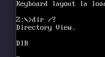

# Guia de ejercicios N1.1 Linea de comandos de DOS-Windows

## Ejercicio 1
---



## Ejercicio 2
En MS-DOS la extension del archivo es el que determina el tipo de archivo y tambien lo que lo hace ejecutable. En linux la extension es mayoritariamente ignorada por el OS ya que sus archivos utilizan MimeTypes para identificar el tipo archivo. 
Para que un archivo sea ejecutable en linux, se debe garantiza chmod +x archivo y que empieze con #!/bin/bash 

## Ejercicio 3
---


Pasa exactamente lo mismo, ya que MS-DOS es Case-Insenstive

## Ejercicio 4 
---

Como estoy en dosbox no hay disco C: pero mostraria todo lo que hay en la raiz del disco C: como ProgamFiles ProgramFiles(x86) etc etc.

## Ejercicio 5
---

Los caracteres comodines de linux y DOS no son iguales.
DOS posee dos wildcards 

+ ? -> Busca reemplazar por exactamente 1 caracter
+ * -> Reemplaza por cualquier cosa de cualquier longitud

Linux tiene 

| Wildcard             | Meaning                                                 | Example                                                   |
| -------------------- | ------------------------------------------------------- | --------------------------------------------------------- |
| `*`                  | Matches **zero or more characters**                     | `*.txt` → `a.txt`, `notes.txt`                            |
| `?`                  | Matches **exactly one character**                       | `?.sh` → `a.sh`, `b.sh`                                   |
| `[abc]`              | Matches **one character** that is `a`, `b`, or `c`      | `file[12].txt` → `file1.txt`, `file2.txt`                 |
| `[a-z]`              | Matches **one character** in a range                    | `file[a-c].txt` → `filea.txt`, `fileb.txt`, `filec.txt`   |
| `[!abc]` or `[^abc]` | Matches any character **except** `a`, `b`, `c`          | `file[!3].txt` → anything except `file3.txt`              |
| `{a,b,c}`            | **Brace expansion**, not a glob: expands to each word   | `file{1,2,3}.txt` → `file1.txt`, `file2.txt`, `file3.txt` |
| `**`                 | Recursive wildcard (with `shopt -s globstar` in `bash`) | `**/*.txt` → finds all `.txt` recursively                 |

## Ejercicio 6
---


Perfecto, acá tenés todas las acciones que pedís, adaptadas al entorno **MS-DOS clásico** o **DOSBox**. Cada ítem se basa en comandos reales que podés probar dentro del prompt de DOS.


### a. Mostrar los archivos que empiecen con “W”:

```powershell
DIR W*.*
```


### b. Mostrar los archivos cuya extensión sea “.EXE”:

```powershell
DIR *.EXE
```


### c. Mostrar todos los archivos incluyendo los **ocultos**:

```powershell
DIR /A
```

> `/A` muestra **todos los archivos**, incluyendo **ocultos**, **de sistema**, etc.


### d. Mostrar solo los archivos **ocultos**:

```powershell
DIR /A:H
```

> `H` = Hidden


### e. Mostrar los archivos de **sólo lectura**:

```powershell
DIR /A:R
```

> `R` = Read-only


### f. Mostrar **solo los nombres de los archivos**:

```powershell
DIR /B
```

> `/B` = Bare format (sin encabezados, sin tamaños, solo los nombres).


### g. Mostrar solo los archivos que **no tengan extensión**:

```powershell
DIR *. /B
```

> En MS-DOS, un archivo sin extensión se ve como `ARCHIVO.` (con un punto al final).


### h. Mostrar solo los **directorios**:

```powershell
DIR /AD
```

> `/A:D` → Solo los archivos con atributo de **Directorio**.


### i. Mostrar solo los **archivos normales** (sin directorios):

```powershell
DIR /A:-D
```

> Muestra todo **menos** los directorios.


### j. Mostrar todos los archivos del disco que comiencen con la letra “A”, **paginados**:

```powershell
DIR A*.* /S /P
```

> `/S` = busca en **todas las subcarpetas**
> `/P` = **paginado**, espera una tecla entre pantallas


### k. Mostrar archivos que empiecen con “lista”, tengan **una letra más** y extensión `.TXT`:

```powershell
DIR LISTA?.TXT
```

> `?` = un carácter más
> Ejemplo: `LISTAA.TXT`, `LISTAB.TXT` — pero **no** `LISTAAB.TXT` ni `LISTA.TXT`.

---

## Ejercicio 7
---

### Códigos del set prompt
| Código | Significado                         |
| ------ | ----------------------------------- |
| `$P`   | Muestra el **path actual**          |
| `$G`   | Muestra el símbolo `>`              |
| `$L`   | Muestra el símbolo `<`              |
| `$B`   | Muestra \`                          | 
| `$T`   | Hora actual                         |
| `$D`   | Fecha actual                        |
| `$N`   | Letra de la unidad actual (ej: `C`) |
| `$Q`   | Igual que `=`                       |
| `$_`   | Nueva línea                         |

```csharp
SET PROMPT=[$D $T] $P$_$
```
Resultado:

```csharp
[07/02/2025 18:25:10] C:\UTILS
$
```

## Ejercicio 8
---
Sirve para cambiar de directorio

## Ejercicio 9
---
Sirve para listar las subrutas del directorio

```csharp
SET PROMPT=[$D $T] $P$_$
```

```cmd
C:.
├── GAMES
│   └── DOOM
├── UTIL
└── DOCS
```